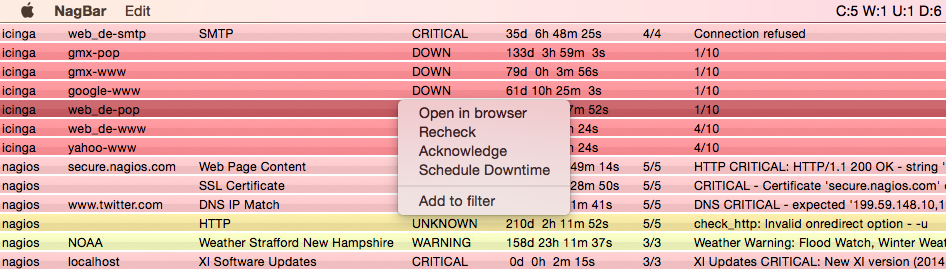

# NagBar

NagBar is a Nagios, Icinga/2 and Thruk monitoring client which runs in the status bar and gives updates about the monitored services. NagBar is a macOS native application.

# Install

The latest release can be downloaded from https://github.com/volendavidov/NagBar/releases/latest

# Build

Requirements to build the app are [CocoaPods](https://cocoapods.org/) and [Xcode](https://developer.apple.com/xcode/).

0. Run `pod setup` in case this is a fresh installation of CocoaPods
1. `cd` into the directory where NagBar source is and run `pod install`
2. Run `open NagBar.xcworkspace`
